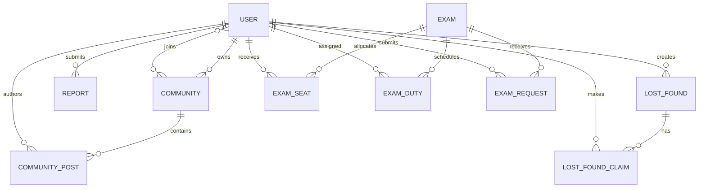

# CampusCare Database ER Diagram

```mermaid
erDiagram
  USER ||--o{ LOST_FOUND : creates
  USER ||--o{ REPORT : submits
  USER ||--o{ COMMUNITY : owns
  USER }o--o{ COMMUNITY : joins
  COMMUNITY ||--o{ COMMUNITY_POST : contains
  USER ||--o{ COMMUNITY_POST : authors
  EXAM ||--o{ EXAM_SEAT : allocates
  USER ||--o{ EXAM_SEAT : receives
  EXAM ||--o{ EXAM_DUTY : schedules
  USER ||--o{ EXAM_DUTY : assigned
  EXAM ||--o{ EXAM_REQUEST : receives
  USER ||--o{ EXAM_REQUEST : submits
  LOST_FOUND ||--o{ LOST_FOUND_CLAIM : has
  USER ||--o{ LOST_FOUND_CLAIM : makes
```
